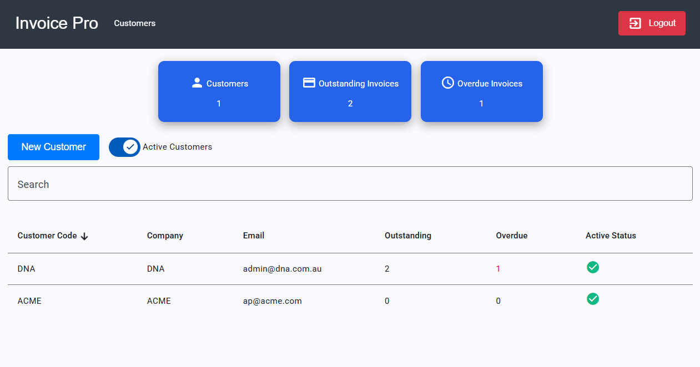

# Invoice Pro

Invoice Pro is a comprehensive invoicing solution designed to streamline your billing process. Whether you're a freelancer, small business owner, or part of a larger enterprise, Invoice Pro offers the tools you need to create, send, and manage invoices efficiently.



Deployment URL:
[https://invoicepro-app.azurewebsites.net/](https://invoicepro-app.azurewebsites.net/)

# API

The backend API for Invoice Pro is built using ASP.NET Core and is hosted on Azure App Service. It provides endpoints for managing invoices, clients, and payments.

# DB

The application uses Azure Postgres SQL Database to store all invoice-related data, including client information, invoice details, and payment records.

# Infrastructure

The Infrastructure is created using Azure Bicep.

## Deployment Instructions

### Install Azure CLI

https://learn.microsoft.com/en-us/cli/azure/install-azure-cli-windows?view=azure-cli-latest&pivots=winget

### Create Resource Group

```
az group create --name InvoiceRG --location "Australia East"
```

### Create Infrastructure

```
az deployment group create --resource-group InvoiceRG --template-file main.bicep --parameters tenantName='invoicepro' adminPassword='{password}' --no-wait
```

### Build Front end

```
cd invoice-app
npm install
npm run build
```

### Deploy Front end

Download azure visual studio code extension login to azure cloud right click on App Service > invoicing-app click deploy app select the following folder and click deploy

```
invoicing-app\dist\invoicing-app\browser
```

### Build Back end

```
cd api
dotnet publish -c Release
```

### Deploy Back end

Download azure visual studio code extension login to azure cloud right click on App Service > invoicing-api click deploy app select the following folder and click deploy

```
api\bin\Release\net9.0\publish
```
